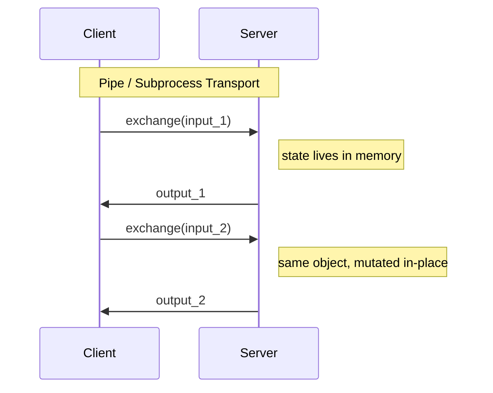
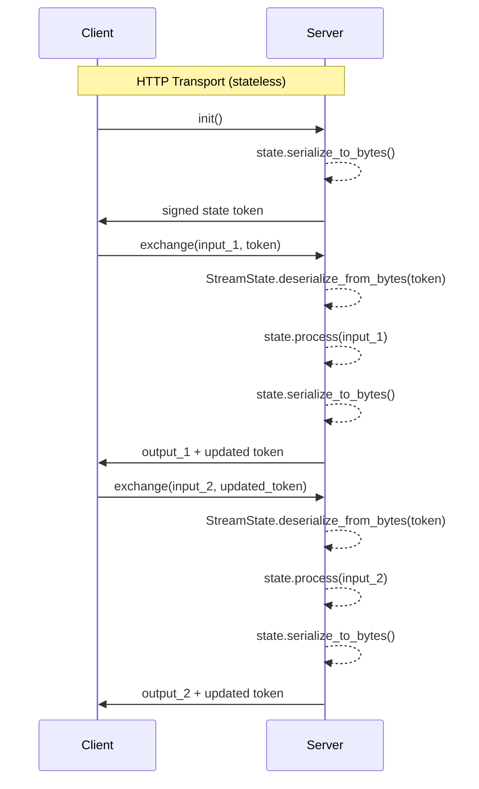

# Streaming

Streaming methods return `Stream[S]` where `S` is a `StreamState` subclass. The state's `process(input, out, ctx)` method is called once per iteration.

- **Producer streams** — server pushes data; client iterates. Call `out.finish()` to end.
- **Exchange streams** — client sends data; server responds each iteration. Client controls termination via `close()`.

## How StreamState Persistence Works

`StreamState` extends [`ArrowSerializableDataclass`](serialization.md#vgi_rpc.utils.ArrowSerializableDataclass), which means **every field you define on your state dataclass is automatically serializable** via Apache Arrow IPC. This is the key mechanism that lets your state survive across streaming calls.

Any field you add to your state class — counters, accumulators, lists, nested dataclasses, enums — is persisted between iterations. Just define it as a dataclass field:

```python
from dataclasses import dataclass, field

from vgi_rpc import ExchangeState, AnnotatedBatch, OutputCollector, CallContext


@dataclass
class RunningStatsState(ExchangeState):
    """All fields are automatically serialized between calls."""

    count: int = 0                            # simple counter
    total: float = 0.0                        # running accumulator
    history: list[float] = field(default_factory=list)  # grows each call
    label: str = ""                           # set once at init

    def exchange(self, input: AnnotatedBatch, out: OutputCollector, ctx: CallContext) -> None:
        """Each call sees the updated state from the previous call."""
        values = input.batch.column("value").to_pylist()
        self.count += len(values)
        self.total += sum(values)
        self.history.extend(values)
        out.emit_pydict({"count": [self.count], "mean": [self.total / self.count]})
```

### Supported field types

State fields use the same type mappings as `ArrowSerializableDataclass`:

| Python type | Arrow type | Example use |
|---|---|---|
| `int` | `int64` | Counters, indices |
| `float` | `float64` | Accumulators, thresholds |
| `str` | `utf8` | Labels, configuration |
| `bool` | `bool_` | Flags |
| `bytes` | `binary` | Raw data |
| `list[T]` | `list_<T>` | History buffers |
| `dict[K, V]` | `map_<K, V>` | Lookup tables |
| `Enum` | `dictionary` | Status tracking |
| `Optional[T]` | nullable `T` | Optional config |
| Nested dataclass | `struct` | Grouped sub-state |

### Why this matters: pipe vs HTTP

The persistence mechanism differs by transport, but your code doesn't need to know:



With pipe and subprocess transports, the `StreamState` object stays in server memory. It's mutated in-place — `self.count += 1` persists because the same Python object handles every call.



With HTTP transport, each request is stateless. After every `process()` call, the framework:

1. Serializes your state to Arrow IPC bytes via `serialize_to_bytes()`
2. Packs the bytes into an HMAC-signed token (prevents tampering)
3. Sends the token back to the client in response metadata
4. The client sends the token back with the next exchange
5. The server deserializes the state and calls `process()` again

This all happens transparently — you write the same `StreamState` subclass regardless of transport.

!!! note "Design your state for serialization"
    Since HTTP transport serializes and deserializes state every exchange, keep state fields to serializable types (see table above). File handles, sockets, database connections, and other non-serializable resources should not be stored in state fields — use `CallContext` or external storage instead.

## Producer vs Exchange

### Producer streams

A producer stream ignores client input and pushes data until `out.finish()`. Use `ProducerState` to skip the unused `input` parameter:

```python
from dataclasses import dataclass

import pyarrow as pa

from vgi_rpc import CallContext, OutputCollector, ProducerState, Stream, StreamState


@dataclass
class PaginatedQueryState(ProducerState):
    """Produces pages of results, tracking the current offset."""

    query: str
    page_size: int = 100
    offset: int = 0        # persisted — increments each call
    exhausted: bool = False # persisted — signals completion

    def produce(self, out: OutputCollector, ctx: CallContext) -> None:
        """Emit one page per call."""
        if self.exhausted:
            out.finish()
            return
        # ... fetch results from offset ...
        results = list(range(self.offset, self.offset + self.page_size))
        if len(results) < self.page_size:
            self.exhausted = True
        self.offset += self.page_size
        out.emit_pydict({"value": results})
```

Client side:

```python
for batch in proxy.search(query="SELECT *", page_size=100):
    rows = batch.batch.to_pylist()
    # process each page
```

### Exchange streams

An exchange stream receives client data each iteration. Use `ExchangeState` for clarity:

```python
from dataclasses import dataclass, field
from enum import Enum

from vgi_rpc import AnnotatedBatch, CallContext, ExchangeState, OutputCollector


class Phase(Enum):
    """Processing phase."""

    COLLECTING = "collecting"
    PROCESSING = "processing"


@dataclass
class StatefulPipeline(ExchangeState):
    """Exchange state with enum and list fields — all serialized automatically."""

    phase: Phase = Phase.COLLECTING
    buffer: list[float] = field(default_factory=list)
    threshold: float = 100.0

    def exchange(self, input: AnnotatedBatch, out: OutputCollector, ctx: CallContext) -> None:
        """Accumulate values, switch phase when threshold is reached."""
        values = input.batch.column("value").to_pylist()
        self.buffer.extend(values)

        if sum(self.buffer) >= self.threshold and self.phase == Phase.COLLECTING:
            self.phase = Phase.PROCESSING

        out.emit_pydict({
            "phase": [self.phase.value],
            "buffer_size": [len(self.buffer)],
            "total": [sum(self.buffer)],
        })
```

Client side:

```python
with proxy.pipeline(threshold=100.0) as session:
    r1 = session.exchange(AnnotatedBatch.from_pydict({"value": [10.0, 20.0]}))
    # phase=collecting, buffer_size=2, total=30.0

    r2 = session.exchange(AnnotatedBatch.from_pydict({"value": [80.0]}))
    # phase=processing, buffer_size=3, total=110.0
```

## Stream Headers

Stream methods can send a one-time `ArrowSerializableDataclass` header before the data stream begins. Declare it as the second type parameter: `Stream[S, H]`. Headers carry metadata that applies to the entire stream — total row counts, column descriptions, job identifiers, or any fixed information the client needs before processing batches.

### Producer with header

Define a header dataclass, use it in the Protocol signature, and return it via `Stream(..., header=...)`:

```python
from dataclasses import dataclass

import pyarrow as pa

from vgi_rpc import (
    ArrowSerializableDataclass,
    CallContext,
    OutputCollector,
    ProducerState,
    Stream,
    StreamState,
)


@dataclass(frozen=True)
class JobHeader(ArrowSerializableDataclass):
    """One-time metadata sent before the stream begins."""

    total_rows: int
    description: str


# Protocol declares the header type
class DataService(Protocol):
    """Service with a header-bearing producer stream."""

    def fetch_rows(self, query: str) -> Stream[StreamState, JobHeader]: ...


# Implementation returns the header alongside the stream
@dataclass
class FetchState(ProducerState):
    """Produces query results."""

    remaining: int

    def produce(self, out: OutputCollector, ctx: CallContext) -> None:
        """Emit one batch per call."""
        if self.remaining <= 0:
            out.finish()
            return
        out.emit_pydict({"value": [self.remaining]})
        self.remaining -= 1


class DataServiceImpl:
    """Implementation with stream headers."""

    def fetch_rows(self, query: str) -> Stream[FetchState, JobHeader]:
        """Return a stream with a header."""
        schema = pa.schema([pa.field("value", pa.int64())])
        header = JobHeader(total_rows=100, description=f"Results for: {query}")
        return Stream(output_schema=schema, state=FetchState(remaining=100), header=header)
```

Client side — access the header via `session.header`:

```python
from vgi_rpc import serve_pipe

with serve_pipe(DataService, DataServiceImpl()) as proxy:
    session = proxy.fetch_rows(query="SELECT *")
    print(session.header)  # JobHeader(total_rows=100, description='Results for: SELECT *')
    for batch in session:
        print(batch.batch.to_pydict())
```

### Exchange with header

Exchange streams work the same way — the header is available when entering the context manager:

```python
from vgi_rpc import AnnotatedBatch

with serve_pipe(DataService, DataServiceImpl()) as proxy:
    with proxy.transform_rows(factor=2.0) as session:
        print(session.header)  # JobHeader(...)
        result = session.exchange(AnnotatedBatch.from_pydict({"value": [1.0]}))
```

### Notes

- For streams without a header (`Stream[S]`), `session.header` returns `None`.
- Use `session.typed_header(JobHeader)` for a typed narrowing that raises `TypeError` if the header is missing or the wrong type.
- Headers work across all transports (pipe, subprocess, HTTP). For HTTP, the header is included in the `/init` response only — subsequent `/exchange` requests do not re-send it.
- Headers are visible in runtime introspection: `MethodDescription.has_header` and `MethodDescription.header_schema`.

## API Reference

### Stream

::: vgi_rpc.rpc.Stream

### StreamState

::: vgi_rpc.rpc.StreamState

### ProducerState

::: vgi_rpc.rpc.ProducerState

### ExchangeState

::: vgi_rpc.rpc.ExchangeState

### StreamSession

::: vgi_rpc.rpc.StreamSession

### OutputCollector

::: vgi_rpc.rpc.OutputCollector

### AnnotatedBatch

::: vgi_rpc.rpc.AnnotatedBatch
